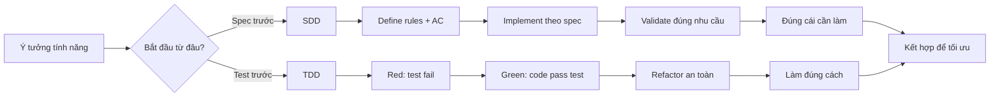
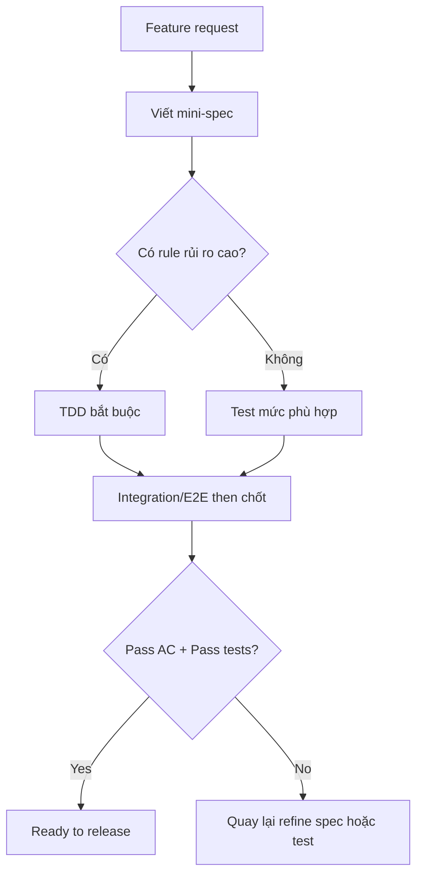

> Bài viết học nhanh cho team product và engineering: hiểu đúng bản chất, thấy rõ ưu nhược điểm, và biết cách kết hợp để ra sản phẩm đúng yêu cầu, ít lỗi.

## 1) Tóm tắt siêu nhanh (đọc 60 giây)

- **TDD (Test-Driven Development)**: viết test trước, viết code sau để test pass.
- **SDD (Spec-Driven Development)**: viết đặc tả trước (spec), rồi triển khai theo spec.

Nếu nói ngắn gọn:

- **TDD giúp bạn "xây đúng kỹ thuật"**.
- **SDD giúp bạn "xây đúng thứ cần xây"**.

Trong phần lớn dự án thực tế, cách hiệu quả nhất là: **SDD ở mức feature + TDD ở mức implementation**.

---

## 2) Định nghĩa rõ ràng

## TDD là gì?

TDD là vòng lặp phát triển **Red -> Green -> Refactor**:

1. **Red**: Viết test mới và để nó fail.
2. **Green**: Viết lượng code nhỏ nhất để test pass.
3. **Refactor**: Tối ưu thiết kế code, test vẫn phải pass.

Mục tiêu chính: chất lượng kỹ thuật ổn định, giảm regression, tăng khả năng refactor an toàn.

## SDD là gì?

SDD là cách phát triển dựa trên **đặc tả (specification)** đã thống nhất:

1. Xác định mục tiêu, phạm vi, rule, acceptance criteria.
2. Thiết kế và triển khai bám theo spec.
3. Kiểm chứng kết quả có khớp spec không.

Mục tiêu chính: đồng bộ giữa business và engineering, hạn chế làm sai nhu cầu.

> Lưu ý: nhiều đội có thể gọi gần nghĩa bằng BDD/ATDD ở một số ngữ cảnh. Cốt lõi vẫn là "spec dẫn đường".

---

## 3) So sánh tổng quan

| Tiêu chí | TDD | SDD |
|---|---|---|
| Điểm bắt đầu | Test case kỹ thuật | Tài liệu đặc tả nghiệp vụ/sản phẩm |
| Đơn vị làm việc chính | Hàm, class, module | Feature, use case, luồng nghiệp vụ |
| Người tham gia chính | Dev (chính) | PO/BA/QA/Dev (liên phòng ban) |
| Mục tiêu gần | Đúng hành vi code | Đúng yêu cầu sản phẩm |
| Mục tiêu xa | Dễ bảo trì, refactor an toàn | Giảm lệch kỳ vọng, dễ kiểm soát scope |
| Artefact sống | Unit/Integration test | Spec + Acceptance criteria + test |
| Rủi ro nếu dùng riêng | Đúng code nhưng sai nhu cầu | Đúng tài liệu nhưng lỗi kỹ thuật |
| Tốc độ phản hồi | Rất nhanh ở mức code | Nhanh ở mức nghiệp vụ nếu spec rõ |

---

## 4) Sơ đồ tư duy nhanh



---

## 5) Ưu điểm chi tiết

## Ưu điểm của TDD

| Nhóm lợi ích | Mô tả |
|---|---|
| Giảm lỗi hồi quy | Test trở thành lưới an toàn, thay đổi dễ phát hiện lỗi sớm |
| Thiết kế tốt hơn | Buộc tách phụ thuộc, tăng tính module, dễ test và dễ maintain |
| Refactor tự tin | Có cảnh báo tức thì khi đổi code làm sai hành vi |
| Vòng phản hồi nhanh | Dev nhận tín hiệu đúng/sai sau vài giây/phút |
| Tài liệu kỹ thuật sống | Tên test và test case phản ánh hành vi mong đợi |

## Ưu điểm của SDD

| Nhóm lợi ích | Mô tả |
|---|---|
| Đồng thuận liên phòng ban | Business, QA, Dev cùng nhìn một nguồn sự thật |
| Giảm hiểu sai yêu cầu | Quy tắc và tiêu chí chấp nhận được làm rõ sớm |
| Quản trị phạm vi tốt | Dễ phát hiện scope creep, quản lý thay đổi rõ ràng |
| Hữu ích cho domain nhạy cảm | Thuận lợi cho audit/compliance/truy vết quyết định |
| Xác định Done rõ hơn | Dựa trên acceptance criteria thay vì cảm tính |

---

## 6) Nhược điểm chi tiết

## Nhược điểm của TDD

| Vấn đề | Tác động |
|---|---|
| Đường học ban đầu dốc | Team mới có thể thấy chậm trong 1-3 sprint đầu |
| Dễ viết test sai trọng tâm | Nếu test bám implementation, test sẽ giòn và tốn công sửa |
| Có thể thiếu góc nhìn E2E | Nhiều unit test pass nhưng flow thật vẫn có thể lỗi |
| Không thay thế phân tích nghiệp vụ | Test đúng chưa chắc yêu cầu business đúng |

## Nhược điểm của SDD

| Vấn đề | Tác động |
|---|---|
| Spec có thể lỗi thời | Nếu không cập nhật, tài liệu lệch thực tế triển khai |
| Nguy cơ nặng quy trình | Quá nhiều thủ tục làm giảm nhịp delivery |
| Chất lượng code không tự tăng | Có spec tốt nhưng vẫn cần kỹ thuật test tốt |
| Phụ thuộc chất lượng viết spec | Spec mơ hồ kéo theo triển khai mơ hồ |

---

## 7) Ví dụ dễ hình dung: tính năng chuyển tiền

## Nếu đi theo SDD trước

Bạn sẽ chốt:

- Rule: hạn mức ngày, điều kiện OTP, phí theo bậc.
- Luồng lỗi: OTP sai 3 lần, timeout khi gọi đối tác, rollback trạng thái giao dịch.
- Acceptance criteria: từng tình huống người dùng thấy gì.

## Sau đó dùng TDD cho phần rủi ro cao

Bạn viết test trước cho:

- Tính phí theo từng tier.
- Chặn giao dịch vượt hạn mức.
- Retry đúng khi timeout có thể phục hồi.
- Không trừ tiền 2 lần khi callback trễ.

Kết quả:

- **SDD** đảm bảo đúng nghiệp vụ.
- **TDD** đảm bảo code bền và ít lỗi hồi quy.

---

## 8) Khi nào nên chọn gì?

| Bối cảnh | Khuyến nghị |
|---|---|
| Startup MVP, thay đổi nhanh, team nhỏ | SDD nhẹ + TDD chọn lọc cho lõi logic |
| Hệ thống tài chính/nhạy cảm, nhiều stakeholder | SDD bắt buộc + TDD mạnh ở core domain |
| Legacy code nhiều rủi ro | Viết characterization test theo TDD trước khi refactor |
| Team mới với testing | Bắt đầu TDD ở module quan trọng, mở rộng dần |

---

## 9) Công thức kết hợp thực dụng (khuyên dùng)

1. **Spec nhẹ 1 trang/feature**: mục tiêu, phạm vi, rule, AC.
2. **Đánh dấu vùng rủi ro cao**: tiền, trạng thái, phân quyền, tích hợp ngoài.
3. **Áp dụng TDD bắt buộc** cho vùng rủi ro cao.
4. **Dùng integration/e2e** cho các luồng chính và lỗi trọng yếu.
5. **Review theo 2 câu hỏi**:
   - Có đúng spec chưa?
   - Có đủ test ngăn regression chưa?



---

## 10) Checklist 15 phút cho team áp dụng ngay

## Checklist SDD nhanh

- Story có mục tiêu business rõ chưa?
- In-scope / out-of-scope đã chốt chưa?
- Có acceptance criteria dạng Given-When-Then chưa?
- Luồng lỗi và edge case đã liệt kê chưa?

## Checklist TDD nhanh

- Đã viết test fail cho rule quan trọng nhất chưa?
- Đã chạy vòng Red -> Green -> Refactor chưa?
- Test đang mô tả hành vi hay đang bám chi tiết implementation?
- Đã có test cho case lỗi và case biên chưa?

---

## 11) Sai lầm phổ biến cần tránh

| Sai lầm | Hậu quả | Cách tránh |
|---|---|---|
| Chỉ TDD, không làm rõ yêu cầu | Code chuẩn kỹ thuật nhưng lệch business | Luôn có mini-spec trước khi code |
| Chỉ SDD, test yếu | Đúng tài liệu nhưng sản phẩm dễ vỡ | Bắt buộc test cho rule rủi ro cao |
| Test viết sau cho có | Không còn tính "driven" | Viết test trước ít nhất ở core logic |
| Spec dài nhưng không đo được | Tranh cãi đúng/sai khi nghiệm thu | AC phải đo được và kiểm thử được |

---

## 12) Kết luận

- **TDD** tối ưu chất lượng kỹ thuật, tốc độ refactor và độ an toàn thay đổi.
- **SDD** tối ưu tính đúng đắn nghiệp vụ, sự đồng thuận và quản trị phạm vi.
- Nếu phải chọn cách làm bền vững cho sản phẩm thật: **kết hợp SDD + TDD**.

Công thức nhớ nhanh:

- **SDD trả lời: "Xây cái gì?"**
- **TDD trả lời: "Xây thế nào để bền?"**

Khi hai thứ đi cùng nhau, team vừa đi đúng hướng vừa đi nhanh hơn theo thời gian.

---

## 13) Phụ lục: Template mini-spec (copy dùng ngay)

```md
# Mini Spec - <Feature Name>

## 1. Goal
- Business goal:
- User value:

## 2. Scope
- In scope:
- Out of scope:

## 3. Business Rules
- Rule 1:
- Rule 2:

## 4. Acceptance Criteria
- AC1 (Given/When/Then):
- AC2 (Given/When/Then):

## 5. Risks
- Main risks:
- Rollback note:
```

## 14) Phụ lục: Template test list (TDD starter)

```md
# TDD Test List - <Feature Name>

## Happy Path
- [ ] Case 1
- [ ] Case 2

## Validation
- [ ] Invalid input 1
- [ ] Invalid input 2

## Error Handling
- [ ] Timeout from dependency
- [ ] Retry/rollback behavior

## Edge Cases
- [ ] Boundary value 1
- [ ] Boundary value 2
```