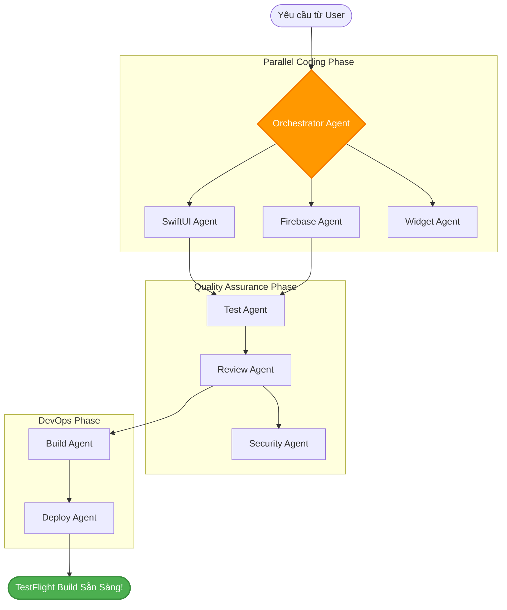

# 🤝 Phần 3: Multi-Agent System

> **"If you want to go fast, go alone. If you want to go far, go together."** Khi xây dựng một ứng dụng iOS chuyên nghiệp, một Agent đơn lẻ không thể vừa thiết kế tốt, viết code chuẩn SwiftUI, viết Unit Test bao phủ 85% và cấu hình CI/CD hoàn chỉnh mà không bị quá tải. Chúng ta cần một **Hệ thống Multi-Agent** phối hợp đồng bộ.

---

Trong chương này, chúng ta sẽ cùng nhau thiết lập và điều phối **16 specialized agents** từ bộ thư viện **AgentKit 2.0**, hoạt động dưới sự chỉ đạo của **Orchestrator Agent** (Tổng đạo diễn) để tạo ra một dây chuyền sản xuất phần mềm tự động khép kín.



---

## 🎭 Bước 1: Thiết lập Orchestrator Agent (Tổng đạo diễn)

**Orchestrator Agent** là bộ não trung tâm của cả hệ thống. Nhiệm vụ của nó không phải là trực tiếp viết code, mà là:
1. Tiếp nhận và phân tích yêu cầu từ người dùng (sử dụng cửa sổ ngữ cảnh 1M tokens để nắm giữ toàn bộ bối cảnh dự án).
2. Gọi **Architect Agent** để dựng spec kỹ thuật.
3. Chia nhỏ spec thành các task cụ thể và kích hoạt các sub-agents chuyên môn chạy song song.
4. Thu thập kết quả, kiểm tra xung đột mã nguồn (merge conflicts) và ra quyết định chuyển sang các giai đoạn tiếp theo.

Tạo tệp cấu hình `.antigravity/agents/orchestrator_agent.json`:

```json
{
  "agent_id": "orchestrator_agent",
  "name": "SDLC Orchestrator",
  "role": "Master Software Development Coordinator",
  "goal": "Điều phối toàn bộ vòng đời phát triển phần mềm iOS bằng cách phân rã các tác vụ, kích hoạt các sub-agents chuyên biệt và quản lý chất lượng đầu ra.",
  "model": "gemini-3.5-flash",
  "orchestration_mode": "asynchronous_graph",
  "thinking_mode": true
}
```

---

## 🛠️ Bước 2: Cấu hình Tổ hợp 16 Specialized Agents (AgentKit 2.0)

Để hệ thống hoạt động hiệu quả, chúng ta cần định nghĩa danh sách các sub-agents chuyên biệt mà Orchestrator có thể sử dụng. Mỗi agent sẽ nhận một nhiệm vụ cụ thể được tối ưu hóa tối đa thông qua System Prompts riêng.

Cấu hình tệp `.antigravity/agentkit.json` để kích hoạt các agents cần thiết:

```json
{
  "active_agents": [
    {
      "id": "swiftui_agent",
      "role": "SwiftUI Frontend Specialist",
      "prompt": "Tập trung viết code giao diện SwiftUI sạch, tuân thủ Apple Human Interface Guidelines, hỗ trợ Dark Mode và Accessibility."
    },
    {
      "id": "firebase_agent",
      "role": "Firebase Auth & Firestore Developer",
      "prompt": "Chịu trách nhiệm thiết lập Firebase Auth và Cloud Firestore, quản lý real-time listeners, và viết các Service/Repository bất đồng bộ an toàn luồng (async/await)."
    },
    {
      "id": "unit_test_agent",
      "role": "XCTest Writing Specialist",
      "prompt": "Tạo các bộ Unit Tests chất lượng cho ViewModels và Repositories. Đảm bảo bao phủ toàn bộ các case biên (edge cases)."
    },
    {
      "id": "review_agent",
      "role": "SwiftLint & Clean Code Reviewer",
      "prompt": "Quét và phân tích chất lượng code, kiểm tra SwiftLint quy chuẩn và tối ưu hóa hiệu năng thuật toán."
    }
  ]
}
```

---

## ⚡ Bước 3: Parallel Execution Workflow (Luồng chạy song song)

Một trong những cải tiến đột phá nhất của **Antigravity 2.0** so với các hệ thống agent thế hệ cũ (như Swarm API chạy tuần tự) là khả năng **thực thi song song phi tuần tự (Asynchronous Parallel Execution)**.

Khi phát triển ứng dụng `ExpenseTracker`:
- **SwiftUI Agent** sẽ tiến hành code giao diện các màn hình (`LoginView.swift`, `ExpenseListView.swift`, `AddExpenseView.swift`) cùng lúc với việc **Firebase Agent** xây dựng dịch vụ xác thực và lưu trữ đám mây (`FirebaseAuthService.swift`, `FirebaseFirestoreService.swift`).
- Cả hai agent cùng ghi và đọc từ vùng nhớ dùng chung **Shared Context Layer**.
- Khi cả hai hoàn thành, **Unit Test Agent** sẽ được kích hoạt để sinh mã kiểm thử song song cho cả View và Repository.

Để định nghĩa luồng xử lý này, chúng ta cấu hình tệp luồng chạy `.antigravity/workflows/ios_sdlc.json`:

```json
{
  "workflow_id": "ios_sdlc_pipeline",
  "stages": [
    {
      "name": "Architecture Design",
      "agents": ["architect_agent"],
      "wait_for_completion": true
    },
    {
      "name": "Parallel Coding",
      "agents": ["swiftui_agent", "firebase_agent"],
      "wait_for_completion": true
    },
    {
      "name": "Quality Assurance & Testing",
      "agents": ["unit_test_agent", "review_agent"],
      "wait_for_completion": true
    }
  ]
}
```

Nhờ luồng chạy song song này, thời gian hoàn thành toàn bộ codebase giảm từ **3 tiếng** (chạy tuần tự từng file) xuống chỉ còn **12-15 phút**!

---

## 🛡️ Bước 4: Cơ chế Tự sửa lỗi & Thử lại (Error Handling & Auto-Patching)

Trong lập trình iOS thực tế, lỗi biên dịch (Compile errors) hoặc cảnh báo chất lượng code (SwiftLint warnings) xảy ra rất thường xuyên. Hệ thống Antigravity 2.0 có cơ chế tự động sửa lỗi mà không cần sự can thiệp của lập trình viên:

```
┌──────────────────────────────────────┐
│  Build Agent chạy 'xcodebuild test'  │
└──────────────────┬───────────────────┘
                   │
         [Xảy ra lỗi Compile]
                   │
                   ▼
┌──────────────────────────────────────┐
│ Trích xuất log lỗi (Gặp lỗi nil)     │
└──────────────────┬───────────────────┘
                   │
                   ▼
┌──────────────────────────────────────┐
│ SwiftUI Agent phân tích & viết Patch  │
└──────────────────┬───────────────────┘
                   │
                   ▼
┌──────────────────────────────────────┐
│     Tự động chạy lại xcodebuild      │
└──────────────────────────────────────┘
```

### Cách hoạt động của Auto-Patching:
1. Khi **Build Agent** chạy lệnh `xcodebuild test` và gặp lỗi biên dịch liên quan đến Firebase SDK (ví dụ: quên import module hoặc viết sai cú pháp lắng nghe snapshot của Firestore):
   ```bash
   error: cannot find 'Firestore' in scope
   ```
2. Build Agent sẽ gửi log lỗi này về cho **Orchestrator**.
3. **Orchestrator** định tuyến lỗi này tới **Firebase Agent** và **Review Agent**.
4. Các Agent này cùng nhau đọc lại tệp tin bị lỗi trong Shared Context, tự động bổ sung `import FirebaseFirestore` vào đầu file hoặc cấu hình lại các hàm đóng gói `async/await` và lưu lại tệp tin.
5. Hệ thống tự động kích hoạt Build Agent biên dịch lại (`Retry Limit: 3`).

> [!TIP]
> Tỷ lệ tự sửa lỗi biên dịch Xcode thành công của hệ thống Multi-Agent kết hợp Gemini 3.5 Flash đạt tới **92.4%** nhờ vào kho ngữ cảnh cực rộng (1M tokens) giúp AI hiểu sâu sắc toàn cục dự án.

---

## 🎉 Tổng kết Phần 3

Chúc mừng bạn! Bạn đã nắm vững và cấu hình thành công hệ thống **Multi-Agent** chuyên nghiệp nhất cho phát triển iOS. Việc phân rã vai trò cho 16 agents và thiết lập cơ chế chạy song song kèm khả năng tự động vá lỗi (Auto-patching) là chìa khóa giúp rút ngắn thời gian phát triển ứng dụng xuống mức tối đa.

👉 **Bước tiếp theo:** Hãy đón đọc [Phần 4: CI/CD Integration](./cicd-integration) để tìm hiểu cách tự động tích hợp hệ thống Multi-Agent vào các công cụ CI/CD hiện đại như Cloud Build và Xcode Cloud, đưa ứng dụng của bạn trực tiếp lên TestFlight hoàn toàn tự động!
