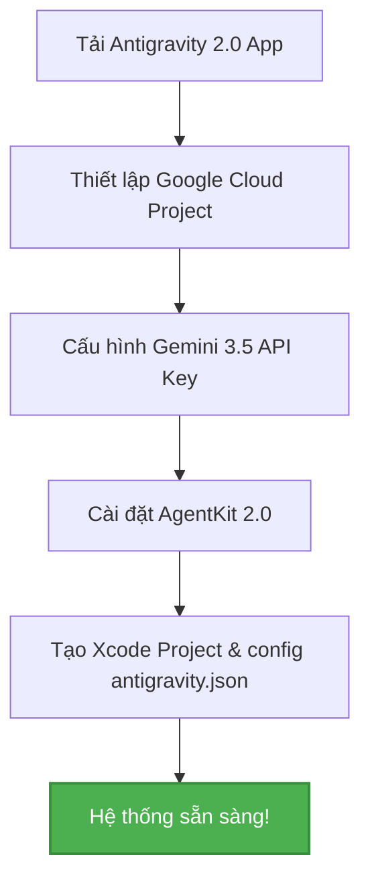

# 🚀 Phần 1: Setup & Configuration

> **Tất cả bắt đầu từ một nền móng vững chắc.** Để hệ thống AI Multi-Agent của bạn có thể tự động hóa toàn bộ vòng đời phát triển ứng dụng iOS trong 30 phút, chúng ta cần cấu hình môi trường phát triển đúng quy chuẩn.

---

Chào mừng bạn đến với chương đầu tiên của hành trình làm chủ **Multi-Agent iOS Development**. Trong bài viết này, chúng ta sẽ cùng nhau đi qua các bước thiết lập từ con số 0 để đưa **Antigravity 2.0** và **Gemini 3.5 Flash** vào hoạt động nhịp nhàng.



---

## 💻 Bước 1: Download & Cài đặt Antigravity 2.0 Desktop App

**Antigravity 2.0** không phải là một plugin IDE thông thường, mà là một **Desktop Platform** được thiết kế nguyên bản cho việc quản lý và điều phối các AI Agent (Agent-First Platform).

### Cách cài đặt:
1. Truy cập trang chủ chính thức tại [Antigravity Codes](https://antigravity.codes).
2. Tải bản cài đặt dành cho **macOS** (Khuyên dùng kiến trúc Apple Silicon - M1/M2/M3/M4 để tối ưu hóa hiệu năng render UI).
3. Kéo biểu tượng **Antigravity** vào thư mục `Applications` của bạn.
4. Mở ứng dụng. Giao diện chính của Antigravity là một **Agent Manager UI** trực quan, hiển thị các tiến trình xử lý song song, lượng token đã tiêu thụ và trạng thái của các sub-agents đang hoạt động.

> [!NOTE]
> Antigravity 2.0 hoạt động hoàn toàn độc lập với Xcode nhưng có khả năng giám sát trực tiếp hệ thống file của project thông qua File System Watcher API với độ trễ gần như bằng 0.

---

## ☁️ Bước 2: Thiết lập Google Cloud Project & Firebase Project

Để khai thác tối đa sức mạnh của Antigravity 2.0 (đặc biệt là tính năng **Managed Agents API** để deploy các agent tùy biến lên cloud), bạn cần một tài khoản Google Cloud Platform (GCP).

### 1. Các bước cấu hình GCP:
1. Truy cập [Google Cloud Console](https://console.cloud.google.com/).
2. Tạo một project mới với tên `antigravity-ios-development`.
3. Bật liên kết thanh toán (Billing) cho project của bạn.
4. Mở mục **API & Services > Library** và kích hoạt các dịch vụ bắt buộc sau:
   - ✅ **Managed Agents API** (Điều phối và đồng bộ các agent từ cloud)
   - ✅ **Secret Manager** (Lưu trữ API keys và Xcode certificates bảo mật)
   - ✅ **Cloud Run** (Để chạy các custom agent ở background nếu cần)
   - ✅ **Cloud Build** (Sử dụng cho CI/CD pipeline compile file `.ipa`)

```bash
# Sử dụng gcloud CLI để kích hoạt nhanh các dịch vụ (tùy chọn)
gcloud services enable \
    managedagents.googleapis.com \
    secretmanager.googleapis.com \
    run.googleapis.com \
    cloudbuild.googleapis.com
```

### 2. Thiết lập Firebase Project liên kết:
Vì Firebase chạy trực tiếp trên nền tảng hạ tầng Google Cloud, dự án GCP của bạn cũng chính là một Firebase Project:
1. Truy cập [Firebase Console](https://console.firebase.google.com/).
2. Nhấp vào **Add Project** và chọn chính xác dự án `antigravity-ios-development` có sẵn của bạn.
3. Nhấp vào biểu tượng **iOS** để thêm ứng dụng iOS mới:
   - Nhập **Bundle ID** của dự án Xcode (ví dụ: `com.tadev.ExpenseTracker`).
   - Tải về tệp cấu hình **`GoogleService-Info.plist`**.
4. Di chuyển tệp `GoogleService-Info.plist` này vào thư mục gốc của Xcode project. Đây là tệp chỉ cấu hình duy nhất giúp các AI Agents và app iOS của bạn giao tiếp bảo mật với backend đám mây.

---

## 🔑 Bước 3: Cấu hình Gemini 3.5 Flash API

**Gemini 3.5 Flash** là "bộ não" điều khiển toàn bộ hệ thống này nhờ khả năng suy luận logic thượng thừa (Pro-level reasoning) và tốc độ cực nhanh (Flash-class speed).

### Lấy API Key từ Google AI Studio:
1. Truy cập [Google AI Studio](https://aistudio.google.com/).
2. Nhấp vào nút **Get API Key** và tạo một khóa mới liên kết với GCP Project vừa tạo ở Bước 2.
3. Sao chép API Key này.

### Cấu hình biến môi trường trong Antigravity:
Mở file cấu hình môi trường `.env` tại thư mục làm việc của bạn hoặc cấu hình trực tiếp trong giao diện Antigravity App:

```env
# /Users/ngoctaduong/tadev-blog/src/data/docs/multi-agent-antigravity/.env
GEMINI_API_KEY=AIzaSyD-your-gemini-3.5-flash-api-key-here
GCP_PROJECT_ID=antigravity-ios-development
ANTIGRAVITY_ENV=production
```

> [!TIP]
> **Mẹo tối ưu chi phí:** Gemini 3.5 Flash cực kỳ tiết kiệm với mức giá chỉ `$1.50 / 1M input tokens`. Bạn có thể kích hoạt tính năng **Context Caching** trong Antigravity để giảm tới 50% chi phí API khi các agent liên tục đọc và sửa đổi cùng một cấu trúc Xcode project.

---

## 🛠️ Bước 4: Cài đặt & Cấu hình AgentKit 2.0

**AgentKit 2.0** là bộ thư viện chứa 16 chuyên gia AI (specialized agents) được tối ưu hóa cho từng tác vụ riêng biệt trong vòng đời phát triển phần mềm (SDLC).

Mở terminal tích hợp bên trong Antigravity Desktop App (hoặc terminal hệ điều hành của bạn) và khởi chạy lệnh cài đặt môi trường agent:

```bash
# Khởi tạo AgentKit 2.0 trong thư mục làm việc của bạn
npx -y agentkit@latest init --platform ios
```

Quá trình khởi tạo sẽ tự động tải các cấu hình mô hình cho 16 agents bao gồm:
- **SwiftUI Agent** & **Data Agent** (Core coding)
- **Unit Test Agent** & **UI Test Agent** (Quality control)
- **Architect Agent** (System design)
- **Build & Deploy Agents** (DevOps pipeline)

Mọi agent sẽ giao tiếp với nhau qua giao thức **Shared Context Layer** của Antigravity để chia sẻ tài nguyên và mã nguồn mà không bị xung đột.

---

## 📲 Bước 5: Tạo Xcode Project Template & Tích hợp Firebase SDK

Để các AI Agents có thể tự động viết code và chạy test, chúng ta cần cung cấp một khung sườn (boilerplate) dự án Xcode chuẩn chỉnh và tích hợp các thư viện Firebase SDK.

### 1. Tạo project mới trên Xcode:
- Mở **Xcode 15+** và tạo một dự án mới: **App > SwiftUI**.
- Đặt tên project: `ExpenseTracker`.
- Chọn ngôn ngữ **Swift** và giao diện **SwiftUI**.

### 2. Tích hợp Firebase SDK thông qua SPM:
1. Trong Xcode, chọn **File > Add Package Dependencies...**
2. Nhập URL của Firebase iOS SDK: `https://github.com/firebase/firebase-ios-sdk`.
3. Chọn các Package Products sau để thêm vào project:
   - **`FirebaseAuth`** (Để xử lý đăng nhập/đăng ký)
   - **`FirebaseFirestore`** (Để lưu trữ dữ liệu đám mây thời gian thực)
4. Đảm bảo bạn đã kéo tệp `GoogleService-Info.plist` tải ở Bước 2 vào thư mục dự án Xcode (chọn *Copy items if needed*).

### 3. Cấu hình khởi tạo Firebase:
Mở tệp ứng dụng chính (ví dụ: `ExpenseTrackerApp.swift`) và thực hiện khởi tạo Firebase ngay khi app khởi động:

```swift
import SwiftUI
import FirebaseCore

@main
struct ExpenseTrackerApp: App {
    // Đăng ký FirebaseApp.configure() khi khởi tạo App
    init() {
        FirebaseApp.configure()
    }

    var body: some Scene {
        WindowGroup {
            ContentView()
        }
    }
}
```

### 4. Thiết lập file cấu hình `antigravity.json`:
Tạo một file có tên `antigravity.json` tại thư mục gốc của project Xcode của bạn. File cấu hình này sẽ chỉ đường giúp các AI Agents hiểu rõ dự án sử dụng Firebase thay vì Core Data.

```json
{
  "project_name": "ExpenseTracker",
  "platform": "ios",
  "swift_version": "5.9",
  "architecture": "MVVM",
  "styling_rules": {
    "framework": "SwiftUI",
    "use_design_system": true,
    "theme": "Dark/Light support",
    "accessibility": "WCAG AA"
  },
  "persistence": "Firebase",
  "firebase_config": {
    "auth": true,
    "firestore": true,
    "plist_path": "GoogleService-Info.plist"
  },
  "testing": {
    "framework": "XCTest",
    "target_coverage": 85.0,
    "ui_testing": true
  },
  "linting": {
    "tool": "SwiftLint",
    "strict_mode": true
  },
  "agents_config": {
    "orchestrator": {
      "model": "gemini-3.5-flash",
      "thinking_mode": true
    },
    "coders": {
      "parallel_limit": 4
    }
  }
}
```

Khi file cấu hình này được tạo, Antigravity Desktop App sẽ tự động quét thấy tệp `GoogleService-Info.plist`, hiển thị trạng thái `Project Connected: ExpenseTracker (Firebase Mode)` kèm theo danh sách các agents chuyên biệt sẵn sàng hành động!

---

## 🎉 Sẵn sàng cất cánh!

Chúc mừng! Bạn đã hoàn thành xuất sắc toàn bộ quy trình thiết lập môi trường cho hệ thống Multi-Agent của mình. Mọi thứ đã sẵn sàng cho sự đột phá.

👉 **Bước tiếp theo:** Hãy cùng tạo và chạy thử nghiệm AI Agent đầu tiên của bạn trong [Phần 2: First Agent](./first-agent) để xem khả năng phân tích và phác thảo kiến trúc của Gemini 3.5 Flash mạnh mẽ đến nhường nào!