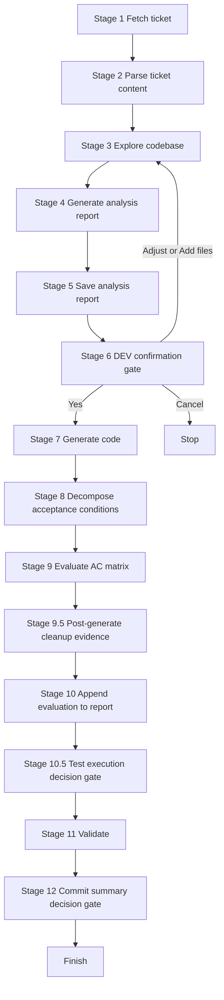

# Chương 2: Thiết kế Pipeline 12 giai đoạn - Chuẩn hóa quy trình làm việc từ JIRA đến Commit Summary

Pipeline của ticket2code được thiết kế như một quy trình vận hành thống nhất cho toàn team.  
Mục tiêu là đảm bảo mọi ticket đều đi qua cùng một chuỗi kiểm soát: đọc đúng yêu cầu, sửa đúng phạm vi, đánh giá đúng Acceptance Criteria, xác nhận đúng quyết định trước khi chốt kết quả.

Điểm cốt lõi của kiến trúc này là không bỏ qua gate, không suy diễn quyết định, và luôn có bằng chứng cho từng kết luận kỹ thuật.

## 1. Bản đồ tổng quan pipeline

## 2. Chi tiết 12 giai đoạn vận hành

1. Stage 1 - Fetch ticket  
Nạp biến môi trường và lấy dữ liệu ticket từ JIRA API.

2. Stage 2 - Parse ticket content  
Trích xuất đầy đủ summary, description, AC, labels, linked issues, attachments và các nhánh điều kiện.

3. Stage 3 - Explore codebase  
Xác định module, API, file bị tác động; đối chiếu rule dự án và lịch sử lỗi phát hành.

4. Stage 4 - Generate analysis report  
Lập kế hoạch sửa đổi: phạm vi file, impact flow, hướng xử lý kỹ thuật.

5. Stage 5 - Save analysis report  
Ghi Section 1 vào report theo mẫu chuẩn.

6. Stage 6 - DEV confirmation gate  
Nhà phát triển quyết định tiếp tục sinh code, chỉnh analysis, thêm file, hoặc dừng.

7. Stage 7 - Generate code  
Thực thi thay đổi trong phạm vi đã duyệt, ưu tiên diff nhỏ và an toàn.

8. Stage 8 - Decompose acceptance conditions  
Tách AC thành đơn vị nguyên tử để kiểm chứng.

9. Stage 9 - Evaluate code against AC matrix  
Đánh giá từng AC theo trạng thái đạt, đạt một phần, chưa đạt, hoặc chưa rõ.

10. Stage 10 - Append evaluation to report  
Bổ sung toàn bộ phần mapping AC, coverage, abnormal-case khi cần, cleanup evidence và kết luận.

11. Stage 11 - Validate  
Kiểm tra tuân thủ coding style, logging policy, test rules, review patterns và dữ liệu nhạy cảm.

12. Stage 12 - Commit summary decision gate  
Quyết định xuất commit summary hoặc kết thúc workflow mà không xuất phần này.

## 3. Hai điểm kiểm soát bắt buộc để tránh lỗi vận hành

1. Test execution decision gate tại Stage 10.5  
Chỉ sau gate này mới được chạy test hoặc build.

2. Commit summary decision gate tại Stage 12  
Chỉ xuất commit summary khi có lựa chọn rõ ràng từ nhà phát triển.

Nếu thiếu lựa chọn explicit tại các gate, luồng phải dừng và không được tự giả định Yes hoặc No.

## 4. Giá trị thực tế cho team

1. Đồng nhất chất lượng đầu ra  
Mọi ticket đi qua cùng một chuẩn kiểm soát.

2. Giảm sai lệch phạm vi sửa đổi  
Code chỉ được tạo sau khi phạm vi được duyệt.

3. Tăng khả năng review và truy vết  
Report có cấu trúc chuẩn, mapping AC rõ ràng, dễ kiểm tra lại quyết định.

4. Vận hành ổn định hơn khi gặp sự cố  
Có thể resume theo stage gần nhất đã hoàn tất thay vì làm lại toàn bộ.

## 5. Kết luận

Pipeline 12 giai đoạn của ticket2code là nền tảng để biến việc dùng AI thành quy trình kỹ thuật có kiểm soát, có bằng chứng, và có khả năng mở rộng cho toàn bộ team.  
Khi mọi ticket đi qua cùng một chuỗi stage và gate, chất lượng không còn phụ thuộc vào thói quen cá nhân mà trở thành năng lực chung của hệ thống phát triển.
