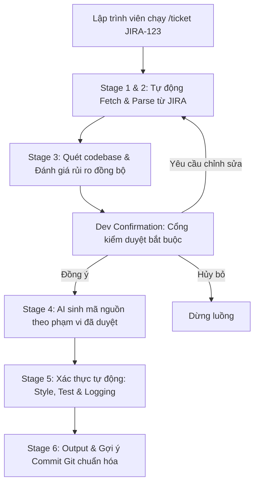

# Chương 2: Thiết kế Pipeline 6 giai đoạn — Cách chuẩn hóa quy trình làm việc từ JIRA đến Git Commit

Ở chương trước, bài viết đã chỉ ra nỗi đau khi mỗi lập trình viên trong team sử dụng AI theo một kiểu khác nhau, dẫn đến sự thiếu nhất quán trong mã nguồn và sót yêu cầu nghiệp vụ. Để giải quyết triệt để vấn đề này, **Pipeline 6 giai đoạn (6-Stage Pipeline)** của ticket2code được thiết kế như giải pháp cốt lõi.

Đây chính là bộ khung quy trình chuẩn hóa, bắt buộc mọi tác vụ phát triển sử dụng AI đều phải đi qua các bước kiểm duyệt và xác thực giống nhau, từ lúc đọc ticket JIRA cho đến khi gợi ý commit Git cuối cùng.

---

## 1. Thiết kế Pipeline: Đồng bộ hóa quy trình của cả team

Thay vì để lập trình viên tự copy-paste mô tả hoặc tự quyết định sửa file nào bằng AI một cách tự phát, Pipeline của ticket2code tự động hóa và đóng khung luồng công việc như sau:

Bằng cách này, dù là lập trình viên Junior hay Senior thực hiện task, quy trình tương tác với AI luôn diễn ra đồng nhất 100%.

---

## 2. Chi tiết kỹ thuật của từng giai đoạn giải quyết bài toán của team

### Giai đoạn 1 & 2: Fetch & Parse (Đồng bộ hóa đầu vào)
*   **Giải quyết nỗi đau:** Lập trình viên đọc sót yêu cầu (Acceptance Criteria - AC) hoặc hiểu sai ý của Product Owner.
*   **Cách hoạt động:** ticket2code tự động gọi JIRA API để tải dữ liệu thô, sau đó phân tích và trích xuất AC một cách khách quan. Cả team sẽ luôn làm việc trên cùng một nguồn thông tin chính xác duy nhất.

### Giai đoạn 3: Analyze (Phân tích codebase & Lập kế hoạch)
*   **Giải quyết nỗi đau:** Lập trình viên tự ý sửa đổi lung tung các file ngoài tầm kiểm soát, gây xung đột mã nguồn (merge conflicts) hoặc lỗi dây chuyền.
*   **Cách hoạt động:** AI quét codebase cục bộ để lập bản đồ tác động (`Impact Flows`). Nó xuất ra danh sách các file chính xác cần sửa. Lập trình viên bắt buộc phải kiểm tra và xác nhận danh sách này trước khi code được viết.

### Giai đoạn 4: Generate (Sinh mã nguồn có kỷ luật)
*   **Giải quyết nỗi đau:** AI sinh thừa code, sử dụng sai thư viện hoặc viết mã nguồn lệch cấu trúc dự án.
*   **Cách hoạt động:** AI chỉ được phép thao tác trên các file đã được duyệt ở Stage 3 và áp dụng nguyên tắc sửa đổi tối thiểu (Minimal Change Set), tôn trọng tuyệt đối cấu trúc hiện tại của dự án.

### Giai đoạn 5: Validate (Xác thực chất lượng tự động)
*   **Giải quyết nỗi đau:** Code viết ra chạy được nhưng thiếu Unit Test, không viết log lỗi hoặc vi phạm coding style của dự án.
*   **Cách hoạt động:** Hệ thống tự động đối chiếu mã nguồn mới với các tài liệu quy chuẩn trong thư mục `docs/`. Nếu AI quên viết log hoặc thiếu test, hệ thống sẽ bắt buộc AI phải bổ sung trước khi bàn giao.

### Giai đoạn 6: Output (Bàn giao & Gợi ý Commit)
*   **Giải quyết nỗi đau:** Lập trình viên viết commit message sơ sài hoặc sai quy chuẩn (ví dụ: `fix bug`, `update code`).
*   **Cách hoạt động:** Gợi ý một tin nhắn commit Git chuẩn hóa (Conventional Commits) dựa trên những thay đổi thực tế đã thực hiện, giúp lịch sử Git của dự án luôn sạch sẽ.

---

## 3. Lợi ích thực tế khi cả team chạy chung một Pipeline

Sau khi áp dụng quy trình Pipeline này, team nhận thấy những cải tiến rõ rệt:

1.  **Tính nhất quán tuyệt đối:** Không còn tình trạng người này viết code kiểu này, người kia viết kiểu khác. Mọi đoạn code được sinh ra bởi AI đều phải đi qua bộ lọc xác thực (Stage 5) để đồng bộ chất lượng.
2.  **Giảm thiểu lỗi lọt lưới:** Cổng kiểm duyệt ở Stage 3 buộc lập trình viên phải dừng lại suy nghĩ về tầm ảnh hưởng của code trước khi nó được ghi đè vào file.
3.  **Dễ dàng bàn giao và review:** Khi một pull request được tạo ra, người review biết chắc chắn rằng code này đã tuân thủ đầy đủ các quy tắc trong `docs/` và đã có unit test đi kèm do Stage 5 bắt buộc.

---

## 4. Kết luận

Pipeline 6 giai đoạn của ticket2code đã chuyển đổi cách thức làm việc với AI từ "tự phát cá nhân" thành "quy trình chuẩn hóa của tập thể". Đó chính là chìa khóa để đạt được hiệu năng thực sự khi áp dụng AI vào phát triển phần mềm dự án.

Trong chương tiếp theo, chúng ta sẽ xem cách ticket2code quét dự án và tìm hiểu các quy tắc viết code riêng biệt của team bạn (Stage 3 & 5) một cách tự động.
